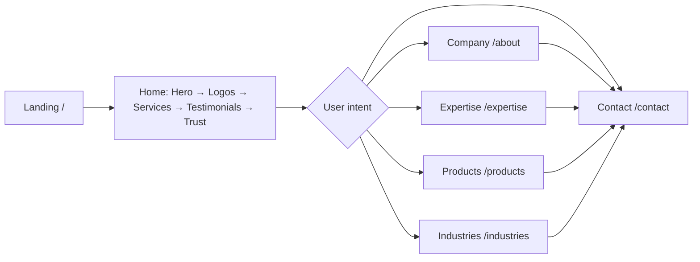

# Appcon Technologies – Site Visualization & Improvement Plan

This document visualizes the website structure and outlines a performance and design improvement plan aligned with known protocols and design laws.

---

## 1. Website Visualization

### 1.1 High-level architecture

```
┌─────────────────────────────────────────────────────────────────────────────┐
│                              index.html                                      │
│  • Meta viewport, description, title                                         │
│  • Google Fonts: Inter, Space Grotesk (blocking)                             │
│  • #root → main.jsx                                                          │
└─────────────────────────────────────────────────────────────────────────────┘
                                        │
                                        ▼
┌─────────────────────────────────────────────────────────────────────────────┐
│                              App.jsx                                         │
│  BrowserRouter → Routes → Layout (Outlet)                                    │
└─────────────────────────────────────────────────────────────────────────────┘
                                        │
                    ┌───────────────────┼───────────────────┐
                    ▼                   ▼                   ▼
            ┌───────────────┐   ┌───────────────┐   ┌───────────────┐
            │   Layout      │   │   Pages       │   │   (routes)    │
            │ • ScrollToTop │   │   (Outlet)   │   │               │
            │ • Navbar      │   │               │   │ /, /about,    │
            │ • <main>      │   │               │   │ /expertise,   │
            │ • StickyCTA   │   │               │   │ /products,    │
            │ • Footer      │   │               │   │ /industries,  │
            └───────────────┘   └───────────────┘   │ /contact      │
                    │                   │           └───────────────┘
                    │                   │
                    ▼                   ▼
```

### 1.2 Component & page tree

```
App
├── Layout
│   ├── ScrollToTop
│   ├── Navbar (fixed, scroll state, mobile menu)
│   ├── <main>
│   │   └── Outlet → one of:
│   │       ├── HomePage
│   │       │   ├── Hero (ParticleCanvas, StatCounter, scroll indicator)
│   │       │   ├── ClientLogos
│   │       │   ├── Services (4 cards)
│   │       │   ├── Testimonials (2 cards)
│   │       │   └── TrustBadges
│   │       ├── AboutPage → PageHeader + About
│   │       ├── ExpertisePage → PageHeader + Expertise (tabs)
│   │       ├── ProductsPage → PageHeader + Products (DMK, LCI, AMC)
│   │       ├── IndustriesPage → PageHeader + Industries (grid)
│   │       └── ContactPage → PageHeader + Contact (form + info)
│   ├── StickyCTA (visible after scroll > 400px)
│   └── Footer (links, back-to-top)
```

### 1.3 User flow (simplified)



### 1.4 Data & asset flow

| Asset / concern        | Current behavior |
|------------------------|-------------------|
| **Fonts**              | Blocking: Inter + Space Grotesk from Google Fonts in `<head>`. |
| **Hero image**         | External Unsplash URL, no explicit dimensions, no `loading="lazy"`. |
| **Logo**               | `/logo.png` used in Navbar and Footer. |
| **Hero background**    | `/hero-bg.svg` + canvas particles (60 particles, requestAnimationFrame loop). |
| **Routing**            | All routes load full Layout; pages are not code-split. |
| **Scroll**             | Multiple listeners: Navbar (scrolled), StickyCTA (visible), ScrollToTop; IntersectionObserver in Hero, Services, Footer, etc. |
```

---

## 2. Performance & Design Improvement Plan

Improvements are aligned with **Core Web Vitals**, **WCAG**, and established **UX/design laws**.

---

### 2.1 Performance (Core Web Vitals & best practices)

#### LCP (Largest Contentful Paint)

| Change | Rationale |
|--------|-----------|
| **Optimize hero image** | Hero uses an external Unsplash URL. Use a local or CDN image with fixed dimensions, `width`/`height` (or `aspect-ratio`) to avoid CLS, and consider `fetchpriority="high"` for LCP. |
| **Non-blocking fonts** | Load Inter/Space Grotesk with `rel="preload"` for critical weights and `font-display: swap` (or use a variable font subset). Reduce to 2–3 weights if possible. |
| **Preconnect to image host** | Add `<link rel="preconnect" href="https://images.unsplash.com">` (or your final image domain) to reduce connection latency. |
| **Defer or simplify hero canvas** | ParticleCanvas runs 60 particles + lines every frame. Consider: fewer particles on mobile, pause when tab is hidden (Page Visibility API), or replace with a lightweight CSS/SVG effect for above-the-fold. |

#### INP / FID (Responsiveness)

| Change | Rationale |
|--------|-----------|
| **Throttle scroll handlers** | Navbar and StickyCTA both use `window.addEventListener('scroll')`. Use a single throttled (e.g. 100ms) or passive scroll handler, or IntersectionObserver where possible. |
| **Reduce main-thread work on scroll** | IntersectionObserver is already used for animations; ensure no heavy JS runs on every scroll (e.g. avoid reading layout in scroll handler). |

#### CLS (Cumulative Layout Shift)

| Change | Rationale |
|--------|-----------|
| **Reserve space for hero image** | Give the hero image a fixed aspect-ratio or min-height so layout doesn’t jump when the image loads. |
| **Reserve space for StickyCTA** | Add `padding-bottom` or a placeholder so when StickyCTA appears (after 400px scroll) the footer doesn’t jump; you already have `main { padding-bottom: 72px }`—confirm it matches StickyCTA height. |
| **Logo dimensions** | Navbar logo has fixed height; ensure `width`/`height` on `` to avoid CLS. |

#### General performance

| Change | Rationale |
|--------|-----------|
| **Route-based code splitting** | Use `React.lazy()` + `Suspense` for route components (HomePage, AboutPage, etc.) so only the current route’s JS is loaded first. |
| **Lazy-load below-the-fold sections** | For HomePage, consider lazy-loading ClientLogos, Testimonials, TrustBadges (e.g. with IntersectionObserver or dynamic import). |
| **Single scroll listener** | One throttled scroll handler that updates both “navbar scrolled” and “StickyCTA visible” to reduce listener overhead. |

---

### 2.2 Accessibility (WCAG 2.x)

| Change | Principle / criterion |
|--------|------------------------|
| **Focus visible** | Ensure `:focus-visible` styles on NavLink, buttons, form controls (e.g. outline/ring) so keyboard users see focus. |
| **Skip link** | Add “Skip to main content” as first focusable element for keyboard/screen-reader users. |
| **Landmarks** | Layout already has `<main>`; ensure one `<nav>` for Navbar and `role="banner"` only once (StickyCTA already has it—consider moving to a single banner or clarifying). |
| **Form labels** | Contact form: ensure every input has a visible or properly associated `<label>`. |
| **Color contrast** | Verify text/background (e.g. `--text-muted` on `--bg`, footer text) meets WCAG AA (4.5:1 normal text, 3:1 large). |
| **Reduced motion** | You already support `prefers-reduced-motion`; keep it and avoid adding critical info only in motion. |

---

### 2.3 Design laws & UX

#### Fitts’s Law (target size & distance)

| Change | Rationale |
|--------|-----------|
| **Touch targets ≥ 44×44px** | Check nav links, CTA buttons, footer “Back to top,” and mobile menu items; ensure minimum 44×44px (or equivalent padding) for touch. |
| **Primary CTA prominence** | “Explore Our Expertise” and “Get in touch” are primary; keep them large and in high-attention areas (you already do; avoid shrinking on mobile). |

#### Hick’s Law (reducing cognitive load)

| Change | Rationale |
|--------|-----------|
| **Limit top-level nav** | 6 items (Home, Company, Expertise, Products, Industries, Contact) is acceptable; avoid adding more without grouping (e.g. mega-menu) if you grow. |
| **Form steps** | Contact form: if you add more fields later, consider a short multi-step flow to keep choices per screen low. |

#### Gestalt (grouping & hierarchy)

| Change | Rationale |
|--------|-----------|
| **Section spacing** | Consistent `section { padding: 100px 0 }` and `.container` create clear grouping; keep spacing consistent. |
| **One primary CTA per block** | Hero has two CTAs (primary + outline); Services are informational. Avoid multiple competing primary CTAs in one section. |

#### Consistency & feedback

| Change | Rationale |
|--------|-----------|
| **Button styles** | Reuse `.btn`, `.btn-primary`, `.btn-outline` site-wide (including StickyCTA and Contact submit). |
| **Loading/error states** | For any future form submit or async actions, add loading and error feedback. |

---

### 2.4 Technical / maintainability

| Change | Rationale |
|--------|-----------|
| **Vite build** | Ensure production build is used in deployment; consider `vite.config.js` options for chunk splitting (e.g. manual chunks for vendor vs routes). |
| **Environment** | If hero or other images move to a CDN, use env variables for base URL. |
| **Preload critical route** | For `/`, consider `preload` of the HomePage chunk so LCP and TTI stay low. |

---

## 3. Priority summary

| Priority | Area | Top actions |
|----------|------|-------------|
| **P0** | LCP | Localize/optimize hero image; add dimensions; non-blocking fonts; preconnect. |
| **P0** | CLS | Reserve space for hero image and StickyCTA; explicit img dimensions. |
| **P1** | Performance | Route-level code splitting; throttle/unify scroll; lighter or conditional particle canvas. |
| **P1** | A11y | Skip link; focus-visible; form labels; contrast check. |
| **P2** | UX | 44px touch targets; keep CTA prominence; loading/error states for forms. |

---

## 4. Next steps

1. **Measure** – Run Lighthouse (Performance + Accessibility) and run a real-user CWV check (e.g. PageSpeed Insights or CrUX) on the live URL.
2. **Implement P0** – Font loading, hero image, preconnect, layout stability.
3. **Implement P1** – Code splitting, scroll handling, accessibility fixes.
4. **Re-measure** – Confirm LCP, INP, CLS, and accessibility score improvements.
5. **Iterate** – Apply P2 and content/design tweaks as needed.

This plan keeps your current design and structure while aligning performance and UX with Core Web Vitals, WCAG, and common design principles (Fitts’s Law, Hick’s Law, Gestalt).
